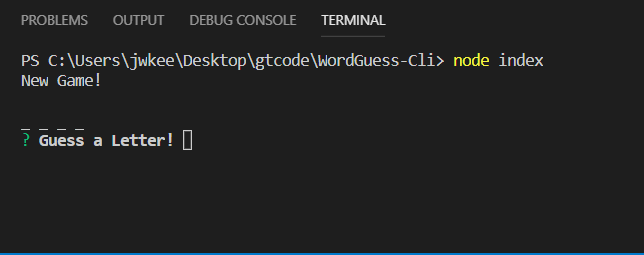
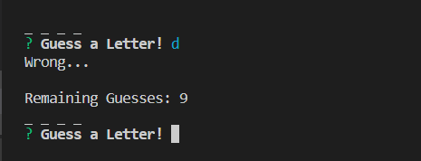
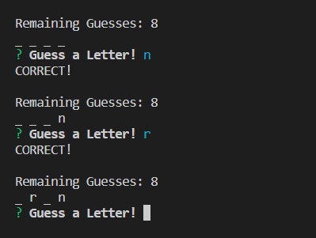
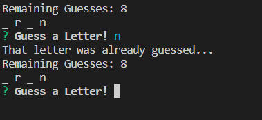
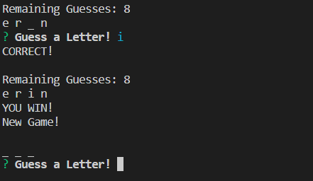
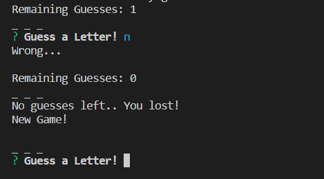

# WordGuess-Cli

## Overview

The WordGuess-Cli node app functions like the classic game Hangman. You are given the length of the word you are guessing, and a set number of incorrect guesses allowed before losing that round. This app, win or lose, automatically selects a new word and begins a new round for you to play.

## Details 

The app starts with this prompt:

and as you select letters, the game does one of three things. If you are incorrect, the game tells you so, and decrements the number of guesses remaining.

If you are correct, the game tells you so, and fills in the letter wherever it appears in the word.

If you have already guessed that letter, the game will tell you this. In all three cases, the game automatically prompts for a new letter.

When you correctly guess a word, the game cheers for you and automatically starts a new game.

If you run out of guesses.. You lost, but a new game is started.

The theme of this WordGuess-Cli application is Characters from the TV show 'The Office'. You may press Ctrl+C to leave the game.